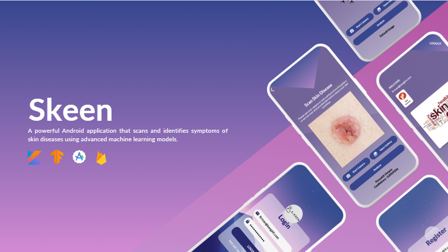

<h1 align="center">SKeen</h1>

## Introduction
S-Keen is an innovative Android application designed to provide accurate and reliable skin disease detection using machine learning. Our mission is to empower vulnerable communities with easy access to skin health diagnosis and resources, thereby improving their overall well-being.

## Features
- **Skin Disease Detection:** Utilize advanced machine learning models to identify various skin diseases from images.
- **User-Friendly Interface:** Simple and intuitive UI/UX design to make the app accessible to everyone.
- **Detailed Reports:** Receive comprehensive information about detected skin conditions.
- **Secure and Private:** Your data is securely stored and privacy is maintained.

## Installation
To install and run the S-Keen application on your local machine, follow these steps:
1. **Clone the Repository:**
    ```bash
    git clone https://github.com/your-username/skeen.git
    ```
    
2. **Open in Android Studio:**
    Open the cloned repository in Android Studio.
   
4. **Build the Project:**
    Build the project to download the necessary dependencies and set up the environment.
   
6. **Run the App:**
    Connect an Android device or use an emulator to run the application.

## Usage
1. **Launch the App:**
   Open the S-Keen application on your Android device.

2. **Scan Your Skin:**
   Use the built-in camera functionality to take a picture of the affected skin area.

3. **Get Diagnosis:**
   The app will analyze the image and provide a detailed report of the detected skin condition.

4. **Follow Health Tips:**
   Review expert tips and recommendations to manage and improve your skin health.

## Contributing
We welcome contributions from the community to help improve S-Keen. If you are interested in contributing, please follow these steps:

1. **Fork the Repository:**
    Click the "Fork" button at the top right of this page to create a copy of this repository in your GitHub account.

2. **Create a Branch:**
    ```bash
    git checkout -b feature/your-feature-name
    ```

3. **Make Your Changes:**
    Implement your feature or bug fix.

4. **Commit and Push:**
    ```bash
    git commit -m "Add your commit message"
    git push origin feature/your-feature-name
    ```

5. **Create a Pull Request:**
    Open a pull request to merge your changes into the main repository.

## License
This project is licensed under the MIT License. See the [LICENSE](LICENSE) file for more details.
